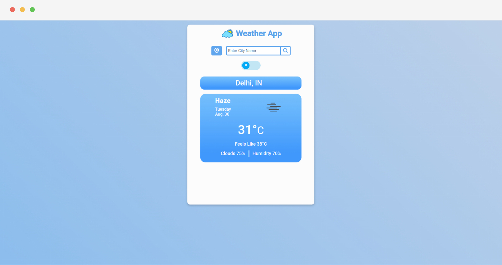

# Weather App



**:point_right: See it live [here](https://rahimratnani.github.io/weather-app/)**

A weather app that shows current weather for a city. It uses [OpenWeatherMap API](https://openweathermap.org/) to fetch current weather. It can show weather in two units (celsius and fahrenheit). It can also fetch weather based on your location if location service is enabled in your browser.

## Features

- Displays current weather data for the given city name.
- Displays current weather data based on user's location.
- Weather data can be viewed in two different units (celsius and fahrenheit).
- Shows different icon for different weather conditions.

## Run It Locally

### Prerequisites

- You'll need an API key from [OpenWeather](https://openweathermap.org/api).

### How to use

```bash
# Clone this repository
$ git clone git@github.com:rahimratnani/weather-app.git

# Go into the repository
$ cd weather-app

# Install dependencies
$ npm install

# Rename .env.example file to .env and open it.
# Add your API key
# Start the application
$ npm start
```

## Technologies Used

- [Reactjs](https://reactjs.org/)
- [TypeScript](https://www.typescriptlang.org/)
- [OpenWeatherMap API](https://openweathermap.org/)
- [Geolocation API](https://developer.mozilla.org/en-US/docs/Web/API/Geolocation_API)

## License

<a href="https://github.com/rahimratnani/weather-app/blob/main/LICENSE">
    
</a>
